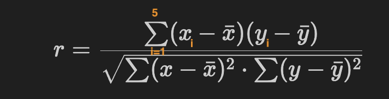
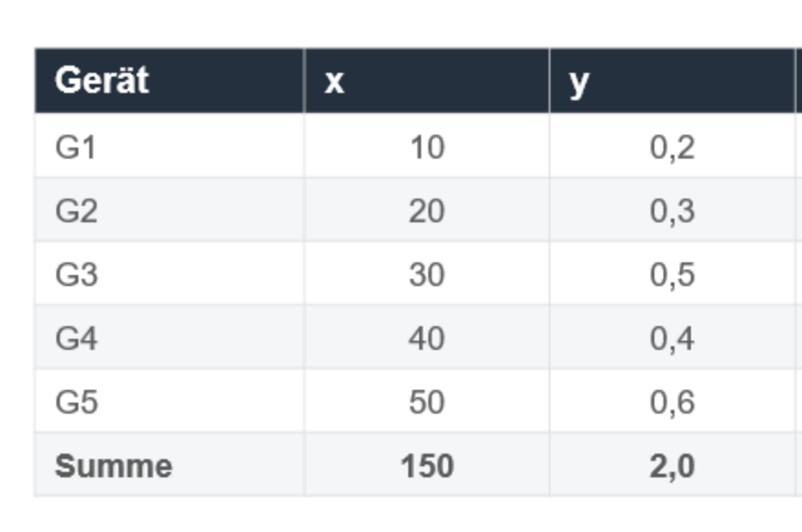
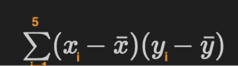

# Korrelationskoeffizient berchnen

## Formel

## Beispiel

## Beispiueldatensatz (siehe Tabelle mit x(i))

x1 = 10, y1= 0.2
x2 = 20, y2= 0.3
x3 = 30, y3 = 0.5
x4 = 40, y4 = 0.4
x5 = 50, y5 = 0.6

### Mittelwerte aus Tabelle

`x-Mittelwert`: 150(Summe aller x) / 5(Anzahl der Werte) = 30
`y-Mittelwert`: 2.0(Summe aller x) / 5(Anzahl der Werte) = 0.4

## Beispielrechnung der Summe anhand des oberen Teils der Formel

(10 - 30) \* (0.2-0.4) + (20-30) \* (0.3-0.4) + ....
