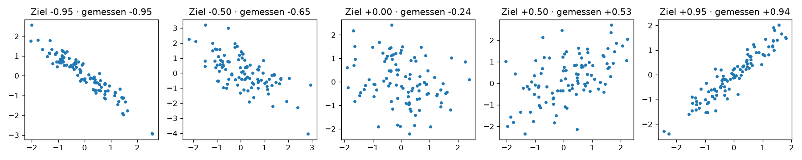

# Python-Aufgabe 2 · Punktwolken erzeugen und schätzen

## Aufgabe

Mit dem folgenden Trick kannst du Daten mit einem **vorgegebenen r** erzeugen:
`y = r · x + √(1 − r²) · Rauschen`

```python
import numpy as np
import matplotlib.pyplot as plt

rng = np.random.default_rng()
ziel_r = [-0.95, -0.5, 0.0, 0.5, 0.95]

fig, axes = plt.subplots(1, 5, figsize=(15, 3))
for ax, r in zip(axes, ziel_r):
    x = rng.normal(size=100)
    rauschen = rng.normal(size=100)
    y = ...                  # TODO: Formel von oben einsetzen
    gemessen = ...           # TODO: r mit np.corrcoef(x, y)[0, 1] messen
    ax.scatter(x, y, s=10)
    ax.set_title(f"Ziel {r:+.2f} · gemessen {gemessen:+.2f}")
plt.tight_layout()
plt.show()
```

**a)** Ergänze die beiden `TODO`-Zeilen und führe das Skript aus.
**b)** Tausche mit einer Partnerin oder einem Partner: Die eine Person ändert `ziel_r` heimlich und blendet die Titel aus (`ax.set_title("")`), die andere schätzt r.
**c)** Warum weicht das gemessene r leicht vom Ziel ab? Was passiert, wenn du statt 100 nur 10 Punkte erzeugst?

---

## Lösung

Erzeugt mit `02_punktwolken.py` (100 Punkte pro Wolke).



## Was das Bild zeigt

Fünf Punktwolken mit vorgegebenem Ziel-r. Im Titel steht jeweils das Ziel und das tatsächlich gemessene r:

| Ziel-r | gemessen (im Bild) | Form der Wolke |
| -----: | -----------------: | -------------- |
| −0,95 | −0,95 | schmales, fallendes Band |
| −0,50 | −0,65 | fallend, aber breit gestreut |
| 0,00 | −0,24 | keine erkennbare Richtung |
| +0,50 | +0,53 | steigend, aber breit gestreut |
| +0,95 | +0,94 | schmales, steigendes Band |

> ⚠️ Das Skript nutzt keinen festen Zufalls-Seed. Bei jedem Lauf entstehen neue Punkte, die gemessenen Werte weichen also etwas von den Zahlen im Bild ab.

## Kernidee im Code

```python
y = r * x + np.sqrt(1 - r**2) * rauschen
gemessen = np.corrcoef(x, y)[0, 1]
```

## c) Warum trifft das gemessene r das Ziel nicht genau?

Die Daten sind zufällig, deshalb trifft die Stichprobe das Ziel nie ganz genau. Mit nur 10 Punkten schwankt das gemessene r viel stärker. Das Skript prüft das mit je 1000 Versuchen bei Ziel r = 0,5. Ein Beispiellauf:

```
n =  10: gemessenes r liegt meist zwischen +0.00 und +0.85
n = 100: gemessenes r liegt meist zwischen +0.37 und +0.62
```

**Fazit:** Bei kleinen Datensätzen ist r unsicher.
