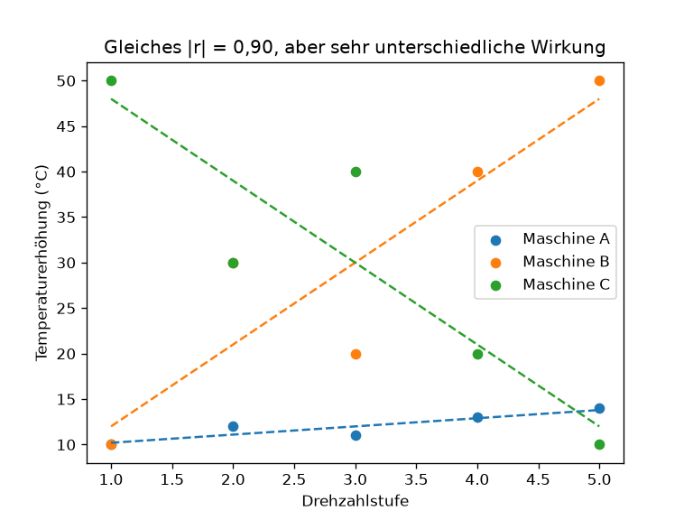

# Python-Aufgabe 4 · r und Steigung vergleichen

## Aufgabe

```python
import numpy as np

stufe = np.array([1, 2, 3, 4, 5])
temp_a = np.array([10, 12, 11, 13, 14])
temp_b = np.array([10, 30, 20, 40, 50])

for name, y in [("A", temp_a), ("B", temp_b)]:
    r = ...                                   # TODO
    steigung, achsenabschnitt = np.polyfit(stufe, y, 1)
    print(f"Maschine {name}: r = {r:.2f}, Steigung = {steigung:.1f} °C pro Stufe")
```

**a)** Ergänze r und führe das Skript aus.
**b)** Erzeuge eine Maschine C, bei der r **gleich** bleibt, die Steigung aber **negativ** ist. _(Tipp: Wie muss sich y verändern?)_ Oder geht das gar nicht? Begründe.
**c)** Zeichne alle Maschinen mit `plt.scatter` in ein gemeinsames Diagramm.

---

## Lösung

Erzeugt mit `04_r_und_steigung.py`.



## Was das Bild zeigt

Drei Maschinen, jeweils mit Ausgleichsgerade (gestrichelt). Alle haben denselben **Betrag** |r| = 0,90, aber eine ganz unterschiedliche Wirkung pro Drehzahlstufe:

| Maschine | r | Steigung | im Bild |
| -------- | ----: | ---------------: | ------- |
| A (blau) | +0,90 | +0,9 °C pro Stufe | fast flach, 10 → 14 °C |
| B (orange) | +0,90 | +9,0 °C pro Stufe | steil steigend, 10 → 50 °C |
| C (grün) | −0,90 | −9,0 °C pro Stufe | steil fallend, 50 → 10 °C |

Ausgabe des Skripts:

```
Maschine A: r = +0.90, Steigung = +0.9 °C pro Stufe
Maschine B: r = +0.90, Steigung = +9.0 °C pro Stufe
Maschine C: r = -0.90, Steigung = -9.0 °C pro Stufe
```

## a) Kernidee im Code

```python
r = np.corrcoef(stufe, y)[0, 1]
steigung, achsenabschnitt = np.polyfit(stufe, y, 1)
```

**r sagt, wie eng die Punkte an der Geraden liegen, nicht wie steil sie ist.** A und B sind gleich eng, aber bei B wirkt jede Stufe zehnmal so stark.

## b) Gleiches r, aber negative Steigung?

Das geht nicht. Wenn die Steigung negativ wird, fällt die Punktwolke, und dann wird auch r negativ. **Das Vorzeichen von r und das Vorzeichen der Steigung sind immer gleich.** Nur der **Betrag** kann unabhängig voneinander variieren. Mit `temp_c = 60 - temp_b` (Maschine C) erhältst du r = −0,90 und eine Steigung von −9.
