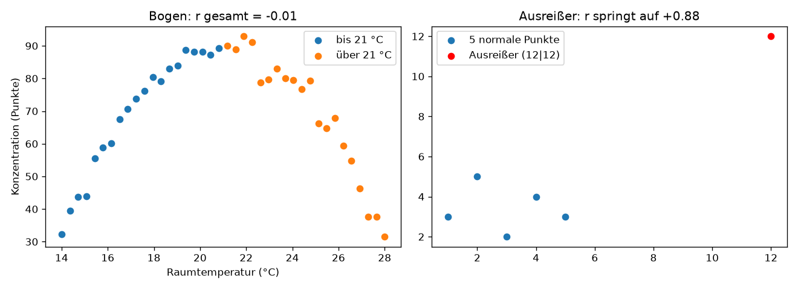

# Python-Aufgabe 5 · Bogen und Ausreißer

## Aufgabe

```python
import numpy as np
import matplotlib.pyplot as plt

# Teil 1: Bogen
rng = np.random.default_rng(1)
raumtemp = np.linspace(14, 28, 40)
konzentration = 90 - 1.2 * (raumtemp - 21) ** 2 + rng.normal(0, 3, 40)

# TODO a) r für alle Punkte berechnen und ausgeben
# TODO b) Daten bei 21 °C teilen und r für beide Hälften getrennt berechnen
# TODO c) Streudiagramm zeichnen

# Teil 2: Ausreißer
x = np.array([1, 2, 3, 4, 5])
y = np.array([3, 5, 2, 4, 3])
# TODO d) r berechnen, dann den Punkt (12|12) mit np.append hinzufügen und r erneut berechnen
```

**e)** Was lernst du aus Teil 1 b)? Wann ist es sinnvoll, Daten aufzuteilen?

---

## Lösung

Erzeugt mit `05_bogen_und_ausreisser.py` (fester Seed, die Zahlen sind bei jedem Lauf gleich).



## Linkes Bild · Bogen

Konzentration in Abhängigkeit von der Raumtemperatur. Bis etwa 21 °C steigt die Konzentration (blau), danach fällt sie wieder (orange).

Ausgabe des Skripts:

```
r gesamt:     -0.01
r bis 21 °C:  +0.96
r über 21 °C: -0.95
```

**e)** Insgesamt ist r ≈ 0, aber in jeder Hälfte gibt es einen sehr starken Zusammenhang (+0,96 und −0,95). Aufteilen lohnt sich, wenn das Streudiagramm einen **Knick** oder **Wendepunkt** zeigt und es dafür einen fachlichen Grund gibt, hier die Wohlfühltemperatur.

## Rechtes Bild · Ausreißer

Fünf normale Punkte ohne erkennbare Richtung (blau) und ein einzelner Ausreißer bei (12 | 12) (rot).

```
ohne Ausreißer: r = -0.14
mit Ausreißer:  r = +0.88
```

**d)** Ein einziger Punkt macht aus „kein Zusammenhang“ scheinbar einen starken gleichläufigen Zusammenhang. Deshalb gilt: **erst schauen, dann rechnen.**

## Zusatz · Aufgabe 5 (Café)

Das Skript rechnet auch die Café-Aufgabe nach: Sonnenstunden und heiße Getränke ergeben **r = 0,00**, obwohl es einen klaren Bogen-Zusammenhang gibt.

## Kernidee im Code

```python
# a)
r_gesamt = np.corrcoef(raumtemp, konzentration)[0, 1]

# b)
kalt = raumtemp <= 21
warm = raumtemp > 21
np.corrcoef(raumtemp[kalt], konzentration[kalt])[0, 1]
np.corrcoef(raumtemp[warm], konzentration[warm])[0, 1]

# d)
x_neu, y_neu = np.append(x, 12), np.append(y, 12)
np.corrcoef(x_neu, y_neu)[0, 1]
```
