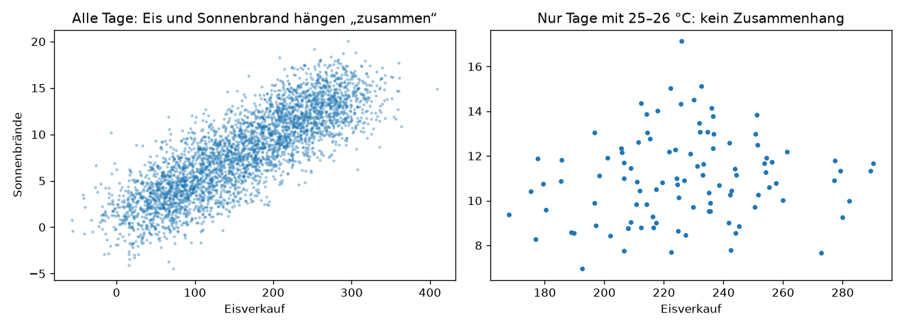

# Python-Aufgabe 8 · Eine Störvariable entlarven

## Aufgabe

Wir simulieren zehn Jahre Freibad-Daten. **Eisverkauf** und **Sonnenbrände** hängen beide **nur** von der Temperatur ab, nicht voneinander.

```python
import numpy as np
import pandas as pd

rng = np.random.default_rng(7)
n = 3650
temperatur = rng.uniform(0, 35, n)                           # die Störvariable
eis = 20 + 8 * temperatur + rng.normal(0, 30, n)             # hängt NUR von der Temperatur ab
sonnenbrand = 1 + 0.4 * temperatur + rng.normal(0, 2, n)     # hängt NUR von der Temperatur ab

df = pd.DataFrame({"temperatur": temperatur, "eis": eis, "sonnenbrand": sonnenbrand})

# TODO a) Korrelationsmatrix mit df.corr() ausgeben. Wie stark korrelieren eis und sonnenbrand?

# TODO b) Weg 3: Temperaturklassen à 1 °C bilden
df["temp_klasse"] = pd.cut(df["temperatur"], bins=range(0, 36, 1))

# TODO c) Für jede Klasse r(eis, sonnenbrand) berechnen und den Durchschnitt ausgeben
#         Tipp: for klasse, gruppe in df.groupby("temp_klasse", observed=True): ...
```

**d)** Vergleiche das r aus a) mit dem Durchschnitt aus c). Was beweist das?
**e)** Übertrage das Vorgehen auf das Laptop-Beispiel: Welche Spalten bräuchtest du, und wie würdest du gruppieren?

---

## Lösung

Erzeugt mit `08_stoervariable_entlarven.py` (fester Seed, die Zahlen sind bei jedem Lauf gleich).



## Was das Bild zeigt

- **Links · alle Tage:** Eisverkauf und Sonnenbrände bilden ein klar steigendes Band. Es sieht so aus, als hingen beide direkt zusammen.
- **Rechts · nur Tage mit 25–26 °C:** Vergleicht man nur Tage mit gleicher Temperatur, ist die Punktwolke ungeordnet. Es gibt keinen Zusammenhang mehr.

## a) Korrelationen insgesamt

```
             temperatur   eis  sonnenbrand
temperatur         1.00  0.94         0.90
eis                0.94  1.00         0.84
sonnenbrand        0.90  0.84         1.00
```

## c) Bei gleicher Temperatur vergleichen (Weg ③)

```python
df["temp_klasse"] = pd.cut(df["temperatur"], bins=range(0, 36, 1))

werte = []
for klasse, gruppe in df.groupby("temp_klasse", observed=True):
    werte.append(gruppe["eis"].corr(gruppe["sonnenbrand"]))
```

```
r insgesamt:                             +0.84
r bei gleicher Temperatur (Durchschnitt): -0.02
```

## d) Deutung

Insgesamt korrelieren Eis und Sonnenbrand stark (r ≈ 0,84). Vergleicht man nur Tage mit **gleicher Temperatur**, verschwindet der Zusammenhang (r ≈ 0). Das zeigt: Die Temperatur ist die Störvariable, Eis und Sonnenbrand haben direkt nichts miteinander zu tun.

## e) Übertragen auf das Laptop-Beispiel

Man bräuchte die Spalten `farbe`, `kaufjahr` (bzw. Alter) und `defekt`. Dann nach Kaufjahr gruppieren und in jeder Gruppe die Defektrate von schwarzen und silbernen Laptops vergleichen: `df.groupby(["kaufjahr", "farbe"])["defekt"].mean()`.

Das Skript simuliert das (ohne Bild). Über alle Laptops sehen die schwarzen deutlich zuverlässiger aus (Defektrate 0,074 statt 0,159). Innerhalb desselben Kaufjahrs liegen beide Farben aber etwa gleich auf. Die Farbe wirkt also nicht, nur das Alter.
